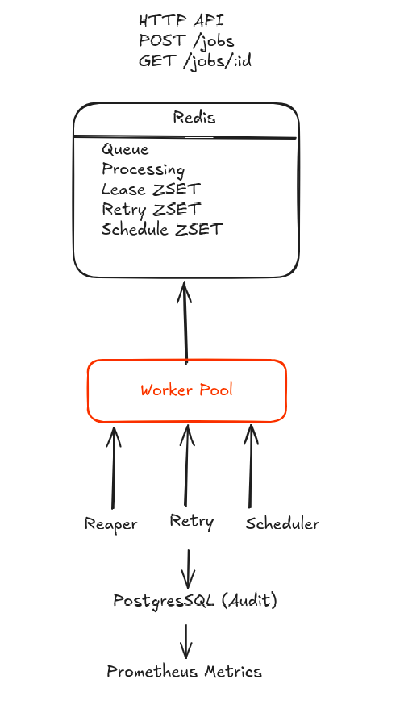

# GoQ — Distributed Background Job Queue

*A production-style distributed background job queue written in Go.*

GoQ is a Redis-backed job queue inspired by systems like Sidekiq, BullMQ, and Asynq. It focuses on **correctness under concurrency**, **crash recovery**, and **production reliability**, rather than simply enqueueing and dequeuing jobs.

The project was built from scratch to demonstrate backend infrastructure engineering concepts including atomic Redis operations, worker coordination, lease-based crash recovery, retry scheduling, idempotent APIs, asynchronous persistence, and observability.

---

## Features

- Reliable job delivery using Redis leases
- Worker crash recovery
- Idempotent job creation
- Exponential retry with dead-letter queue
- Delayed & scheduled jobs
- Concurrent worker pool with graceful shutdown
- Batched asynchronous PostgreSQL audit logging
- Prometheus metrics
- Docker Compose deployment
- Race-tested Go implementation

---

## Architecture


Redis contains every hot-path data structure required for queue processing.

PostgreSQL is intentionally **not** part of the critical execution path—it stores an asynchronous audit history only, ensuring database latency never blocks workers.

---

# Reliability Guarantees

## Crash-safe processing

Workers claim jobs atomically using Redis `BRPOPLPUSH`.

Jobs remain in the processing list until explicitly acknowledged, preventing message loss if a worker exits unexpectedly.

A background reaper scans expired leases and atomically returns abandoned jobs back to the queue using a Lua script.

---

## Idempotent job submission

Clients may include an `Idempotency-Key` header.

The key is atomically claimed before job creation, ensuring repeated HTTP requests return the original job instead of creating duplicates.

---

## Retry handling

Failed jobs use exponential backoff:

```text
2s
↓

4s
↓

8s
↓

Dead Letter Queue
```

Retries are scheduled through Redis sorted sets, preventing failing jobs from overwhelming downstream services.

---

## Non-blocking audit logging

Worker throughput is independent of PostgreSQL.

Audit events are buffered in memory and flushed in batches.

If PostgreSQL becomes unavailable, job execution continues uninterrupted.

---

# Technology Stack

| Component | Technology |
|------------|------------|
| Language | Go 1.25 |
| HTTP | `net/http` |
| Queue | Redis |
| Database | PostgreSQL |
| Metrics | Prometheus |
| Containers | Docker Compose |
| Redis Client | `go-redis/v9` |
| PostgreSQL Driver | `pgx/v5` |

---

# API

| Method | Endpoint | Description |
|---------|----------|-------------|
| `POST` | `/jobs` | Enqueue a new job |
| `GET` | `/jobs/:id` | Retrieve job status |
| `GET` | `/queues/:name/stats` | Queue statistics |
| `GET` | `/metrics` | Prometheus metrics |

Example:

```bash
curl -X POST localhost:8080/jobs \
  -H "Content-Type: application/json" \
  -H "Idempotency-Key: abc123" \
  -d '{
        "queue":"emails",
        "payload":"welcome-email",
        "priority":1
      }'
```

---

# Running Locally

```bash
git clone https://github.com/Tharun-bot/goq.git

cd goq

docker compose up -d
```

The compose stack starts:

- Redis
- PostgreSQL
- API server
- Worker

Configuration is environment-driven:

```text
REDIS_URL
DATABASE_URL
API_PORT
```

---

## Running Tests

```bash
go test ./internal/... -v -race
```

---

## Smoke Test

Submits 1000 real jobs and verifies the queue completely drains.

```bash
API_URL=http://localhost:8080 ./scripts/smoke_test.sh
```

---

# Benchmarks

Measured using Vegeta against `POST /jobs`.

| Rate | Requests | Success | p50 | p95 | p99 |
|------:|---------:|---------:|----:|----:|----:|
| 200/sec | 6,000 | 100% | 836µs | 1.48ms | 1.78ms |
| 2,000/sec | 30,000 | 100% | 616µs | 813µs | 1.16ms |

The enqueue API maintained **100% success** with **sub-2ms p99 latency** under 10× higher load.

End-to-end processing was separately verified through a 1000-job smoke test that completely drained the queue.

---

# Project Evolution

The project was built incrementally, with each stage validated before moving to the next.

1. Project scaffolding
2. Redis queue implementation
3. Concurrent worker pool
4. Lease-based crash recovery
5. Retry scheduling & dead-letter queue
6. Delayed jobs
7. REST API & idempotency
8. PostgreSQL write-behind audit log
9. Prometheus instrumentation
10. Docker packaging & benchmarking

---

# Current Limitations

- Workers consume a single queue per process.
- Queue priorities are stored but not yet used during scheduling.
- Designed for a single deployment instance; distributed leader election is intentionally out of scope.

---

# Future Improvements

- Multi-queue worker scheduling
- Priority-aware dequeueing
- Distributed worker coordination
- Rate limiting
- Job cancellation
- Cron-style recurring jobs
- Web dashboard
- OpenTelemetry tracing
- Horizontal worker autoscaling

---

# License

MIT